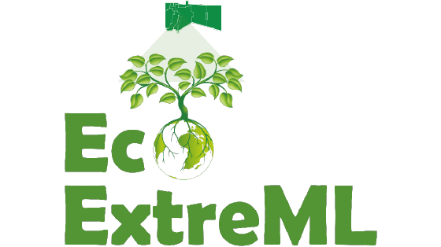

# Getting started

This is the documentation for the python package `PyStemmusScope`, which allows for for
running the STEMMUS-SCOPE model.

The model source code, executable file and utility files are available in the
<!-- markdown-link-check-disable-next-line -->
[STEMMUS_SCOPE repository](https://github.com/EcoExtreML/STEMMUS_SCOPE).

The input datasets are available on Snellius and CRIB. First, make sure you have
right access to the repository and data.

## Running the model

1. Using executable file: As a user, you don't need to have a MATLAB license to
run the STEMMUS-SCOPE model. If `PyStemmusScope` and `MATLAB Runtime` are
installed on a Unix-like system (e.g. your own machine, Snellius or WSL), you
can run STEMMUS_SCOPE using the executable file.
2. Using Matlab: If `PyStemmusScope` and `Matlab` are installed, you can run
STEMMUS_SCOPE from the source code, for example on Snellius or CRIB.
3. Using Octave: If `PyStemmusScope` and latest `Octave` including required
packages are installed, you can run STEMMUS_SCOPE from its source code, for
example on CRIB or your own machine.

See section [Installation Instructions](installation_instructions.md) for required packages.

