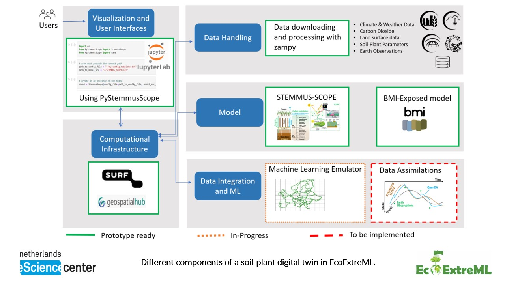

#

The python package `PyStemmusScope` allows for preparing data and running the
STEMMUS-SCOPE model, where STEMMUS simulates soil water and heat, and the model
SCOPE the vegetation photosynthesis and land surface energy balance. In
addition, it supports the use of the Basic Model Interface (BMI) to couple the
model with other models.

The python package `PyStemmusScope` is developed in [EcoExtreML
project](https://research-software-directory.org/projects/ecoextreml).
